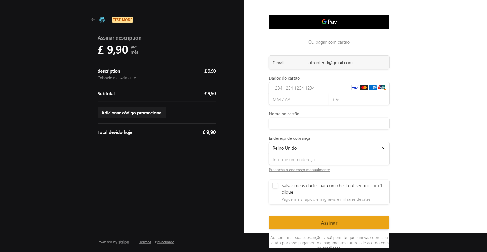

## 🚀 About the Project
The Ig.news is a News Portal with CMS. Integrated payment method integrated with the Strip's API and Database in FaunaDB 
The application is built with the Serveless model, without external API for data manipulation.
<br/>
For payment method you can use this fake number: ``` 4242 4242 4242 4242 ```

## 💻 Project Image

<div align="center">
    
   </br>
    
</div>

## 🧰 Technologies
This project was developed with the following technologies:
* NextJS
* ReacJS
* Typescript
* Sass
* FaunaDB
* Stripe
* Prismic.io

## ⚙️ Installation
```bash
# You need to install Node.js, then in order to clone the project via HTTPS, run this command:
$ https://github.com/LeonardoMarquesDias/igNews.git
# or use the download option.

# Install dependencies
$ yarn install
or
$ npm install

# Run the following command to start the fake API with JSON Server to simulate an API that has foods information:
$ yarn server
or
$ npm server

# Run the following command to start the application in a development environment:
$ yarn start
or
$ npm start

# Access http://localhost:3000 
```

## 📝 License

This project is licensed under the MIT License - see the LICENSE file for details.

---

by [Leonardo Dias](https://github.com/LeonardoMarquesDias) 😛
